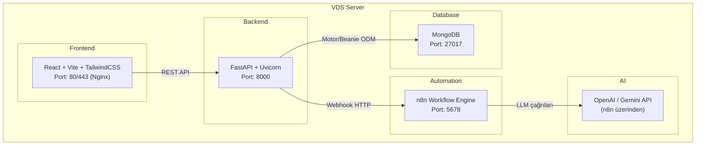

# 🖥️ Online Diyetisyen Platformu — VDS Deployment Rehberi

## 📋 Proje Analizi

### Genel Mimari

Bu proje, tek diyetisyen modelli bir **Online Diyetisyen Platformu**'dur. Üç ana katmandan oluşur:



---

### Bileşen Detayları

#### 🔹 Backend (Python / FastAPI)
| Özellik | Detay |
|---------|-------|
| Framework | **FastAPI** + **Uvicorn** (ASGI) |
| ORM | **Beanie** (async MongoDB ODM) + **Motor** (async driver) |
| Auth | **JWT** (python-jose) + **bcrypt** (passlib) + **Google OAuth2** |
| Validation | **Pydantic v2** + **email-validator** |
| HTTP Client | **httpx** (n8n webhook çağrıları için) |
| Python | 3.10+ gerekli |

**API Endpoint'leri (10 modül):**
- `/api/v1/auth` — Kayıt, giriş, Google OAuth
- `/api/v1/dietitians` — Diyetisyen profil yönetimi
- `/api/v1/members` — Üye profil yönetimi
- `/api/v1/chats` — Mesajlaşma sistemi
- `/api/v1/subscriptions` — Abonelik yönetimi
- `/api/v1/admin` — Admin paneli (diyetisyen CRUD)
- `/api/v1/daily-logs` — Günlük beslenme logları
- `/api/v1/dietitian` — Diyetisyen dashboard
- `/api/v1/ai` — AI analiz, beslenme planı, günlük rapor, agentic AI
- `/api/v1/notifications` — Bildirimler

**Veritabanı Modelleri (MongoDB Collections):**
- `users` — Temel kullanıcı bilgileri
- `dietitians` — Diyetisyen profilleri
- `members` — Üye profilleri (boy, kilo, hedefler, kalori hesaplamaları)
- `nutrition_plans` — Beslenme programları (öğünler, hedefler)
- `daily_logs` — Günlük beslenme takibi
- `chats` / `messages` — Mesajlaşma
- `subscription_plans` / `user_subscriptions` — Abonelikler
- `agentic_reports` — AI günlük raporları
- `notifications` — Bildirimler

#### 🔹 Frontend (React / TypeScript)
| Özellik | Detay |
|---------|-------|
| Framework | **React 18** + **TypeScript** |
| Build Tool | **Vite 5** |
| Styling | **TailwindCSS 3** + **shadcn/ui** (Radix UI) |
| State | **React Query (TanStack)** + **React Context** |
| Routing | **React Router v6** |
| Charts | **Recharts** |
| Auth | **Google OAuth** (@react-oauth/google) |
| HTTP | **Axios** |

**Sayfalar (24 adet):**
- Landing, Login, Register (herkese açık)
- Dashboard, Profile, Progress, Settings, Messages (üye)
- DietitianDashboard, MemberDetail, CreateNutritionPlan, EditNutritionPlan (diyetisyen)
- CalorieCalculator, DetailedCalorieCalculator, DailyReport, AgenticDashboard (AI)
- AdminPanel (admin)
- About, Contact, TermsOfService, PrivacyPolicy (yasal)

#### 🔹 n8n (Workflow Automation)
| Özellik | Detay |
|---------|-------|
| Kullanım | AI webhook'ları |
| Port | 5678 |

**4 Aktif Webhook:**
| Webhook URL | İşlev | Timeout |
|------------|-------|---------|
| `/webhook/ai-analyze` | Üye analizi (BMI, kalori, hedef) | 60s |
| `/webhook/ai-weekly-progress` | Haftalık gelişim raporu | 60s |
| `/webhook/ai-daily-report` | Günlük toplu danışan raporu | 90s |
| `/webhook/ai-generate-plan` | AI beslenme programı oluşturma | 90s |
| `/webhook/agentic-manual-trigger` | Agentic AI tetikleyici | 90s |

#### 🔹 MongoDB
| Özellik | Detay |
|---------|-------|
| Varsayılan Port | 27017 |
| Veritabanı | `online_dietitian_v1` |
| Koleksiyon Sayısı | ~9 |
| Driver | Motor (async) |

---

## 💻 VDS Sistem Gereksinimleri

### Minimum Gereksinimler (≤50 kullanıcı)

| Kaynak | Minimum | Önerilen |
|--------|---------|----------|
| **CPU** | 2 vCPU | 4 vCPU |
| **RAM** | 4 GB | 8 GB |
| **Disk** | 40 GB SSD | 80 GB NVMe SSD |
| **Bant Genişliği** | 1 TB/ay | 2 TB/ay |
| **Network** | 100 Mbps | 1 Gbps |

### Önerilen Gereksinimler (50-500 kullanıcı)

| Kaynak | Önerilen |
|--------|----------|
| **CPU** | 4-8 vCPU |
| **RAM** | 8-16 GB |
| **Disk** | 100-200 GB NVMe SSD |
| **Bant Genişliği** | 3-5 TB/ay |
| **Network** | 1 Gbps |

### RAM Kullanım Tahmini

| Bileşen | Min RAM | Önerilen RAM |
|---------|---------|-------------|
| **MongoDB** | 1 GB | 2-4 GB |
| **FastAPI + Uvicorn** (4 worker) | 512 MB | 1 GB |
| **n8n** | 512 MB | 1 GB |
| **Nginx** | 64 MB | 128 MB |
| **OS (Linux)** | 512 MB | 1 GB |
| **OS (Windows)** | 2 GB | 4 GB |
| **Toplam (Linux)** | **~2.5 GB** | **~5 GB** |
| **Toplam (Windows)** | **~4.5 GB** | **~9 GB** |

> [!IMPORTANT]
> **Linux VDS kesinlikle önerilir!** Windows Server, OS'un kendisi 2-4 GB RAM tüketir. Aynı kaynaklarla Linux çok daha performanslı çalışır.

---

## 🐧 Linux VDS Kurulumu (Ubuntu 22.04/24.04 — ÖNERİLEN)

### Gerekli Yazılımlar

| Yazılım | Versiyon | Kurulum Yöntemi |
|---------|---------|-----------------|
| **Ubuntu Server** | 22.04 LTS veya 24.04 LTS | VDS sağlayıcıdan |
| **Python** | 3.10+ | `apt` veya `pyenv` |
| **Node.js** | 18 LTS veya 20 LTS | `nvm` veya `nodesource` |
| **MongoDB** | 7.0+ | MongoDB repo |
| **n8n** | Latest | `npm` veya Docker |
| **Nginx** | Latest | `apt` |
| **Certbot** | Latest | `snap` (SSL için) |
| **Git** | Latest | `apt` |
| **PM2** veya **Supervisor** | Latest | Process manager |

### Adım Adım Kurulum

```bash
# 1. Sistem Güncelleme
sudo apt update && sudo apt upgrade -y

# 2. Temel Araçlar
sudo apt install -y git curl wget build-essential software-properties-common

# 3. Python 3.10+
sudo apt install -y python3 python3-pip python3-venv

# 4. Node.js 20 LTS (n8n ve frontend build için)
curl -fsSL https://deb.nodesource.com/setup_20.x | sudo -E bash -
sudo apt install -y nodejs

# 5. MongoDB 7.0
curl -fsSL https://www.mongodb.org/static/pgp/server-7.0.asc | \
  sudo gpg -o /usr/share/keyrings/mongodb-server-7.0.gpg --dearmor
echo "deb [ signed-by=/usr/share/keyrings/mongodb-server-7.0.gpg ] https://repo.mongodb.org/apt/ubuntu jammy/mongodb-org/7.0 multiverse" | \
  sudo tee /etc/apt/sources.list.d/mongodb-org-7.0.list
sudo apt update
sudo apt install -y mongodb-org
sudo systemctl start mongod
sudo systemctl enable mongod

# 6. n8n (Global kurulum)
sudo npm install -g n8n

# 7. Nginx (Reverse Proxy)
sudo apt install -y nginx

# 8. Certbot (SSL Sertifikası - Let's Encrypt)
sudo snap install --classic certbot
sudo ln -s /snap/bin/certbot /usr/bin/certbot

# 9. PM2 (Process Manager)
sudo npm install -g pm2
```

### Proje Kurulumu

```bash
# Proje dizini oluştur
sudo mkdir -p /opt/dietitian-platform
cd /opt/dietitian-platform

# Projeyi yükle (git veya scp ile)
# git clone <repo-url> .
# veya scp ile kopyala

# --- BACKEND ---
cd /opt/dietitian-platform/backend
python3 -m venv venv
source venv/bin/activate
pip install -r requirements.txt

# .env dosyası oluştur
cat > .env << 'EOF'
PROJECT_NAME=Online Dietitian Platform
SECRET_KEY=<GÜÇLÜ_BİR_RANDOM_KEY_BURAYA>
MONGODB_URL=mongodb://localhost:27017
DATABASE_NAME=online_dietitian_v1
GOOGLE_CLIENT_ID=<GOOGLE_CLIENT_ID>
GOOGLE_CLIENT_SECRET=<GOOGLE_CLIENT_SECRET>
EOF

# --- FRONTEND ---
cd /opt/dietitian-platform/frontend
npm install
# .env dosyasını production için düzenle
cat > .env << 'EOF'
VITE_GOOGLE_CLIENT_ID=<GOOGLE_CLIENT_ID>
VITE_API_URL=https://api.yourdomain.com
EOF
npm run build
# dist/ klasörü Nginx ile serve edilecek
```

### PM2 ile Servis Yönetimi

```bash
# ecosystem.config.js oluştur
cat > /opt/dietitian-platform/ecosystem.config.js << 'EOF'
module.exports = {
  apps: [
    {
      name: 'backend',
      cwd: '/opt/dietitian-platform/backend',
      script: 'venv/bin/uvicorn',
      args: 'app.main:app --host 0.0.0.0 --port 8000 --workers 4',
      env: {
        PYTHONPATH: '/opt/dietitian-platform/backend'
      }
    },
    {
      name: 'n8n',
      script: 'n8n',
      args: 'start',
      env: {
        N8N_PORT: '5678',
        N8N_PROTOCOL: 'http',
        WEBHOOK_URL: 'https://n8n.yourdomain.com/',
        N8N_BASIC_AUTH_ACTIVE: 'true',
        N8N_BASIC_AUTH_USER: 'admin',
        N8N_BASIC_AUTH_PASSWORD: '<GÜÇLÜ_ŞİFRE>'
      }
    }
  ]
};
EOF

# Servisleri başlat
pm2 start ecosystem.config.js
pm2 save
pm2 startup  # Otomatik başlatma
```

### Nginx Konfigürasyonu

```nginx
# /etc/nginx/sites-available/dietitian-platform

# Frontend (Ana domain)
server {
    listen 80;
    server_name yourdomain.com www.yourdomain.com;

    root /opt/dietitian-platform/frontend/dist;
    index index.html;

    # SPA routing
    location / {
        try_files $uri $uri/ /index.html;
    }

    # Gzip sıkıştırma
    gzip on;
    gzip_types text/plain text/css application/json application/javascript text/xml;
}

# Backend API (Subdomain)
server {
    listen 80;
    server_name api.yourdomain.com;

    location / {
        proxy_pass http://127.0.0.1:8000;
        proxy_set_header Host $host;
        proxy_set_header X-Real-IP $remote_addr;
        proxy_set_header X-Forwarded-For $proxy_add_x_forwarded_for;
        proxy_set_header X-Forwarded-Proto $scheme;
        proxy_read_timeout 120s;
    }
}

# n8n (Subdomain)
server {
    listen 80;
    server_name n8n.yourdomain.com;

    location / {
        proxy_pass http://127.0.0.1:5678;
        proxy_set_header Host $host;
        proxy_set_header X-Real-IP $remote_addr;
        proxy_http_version 1.1;
        proxy_set_header Upgrade $http_upgrade;
        proxy_set_header Connection "upgrade";
    }
}
```

```bash
# Nginx'i aktifleştir
sudo ln -s /etc/nginx/sites-available/dietitian-platform /etc/nginx/sites-enabled/
sudo nginx -t
sudo systemctl restart nginx

# SSL sertifikaları al
sudo certbot --nginx -d yourdomain.com -d www.yourdomain.com -d api.yourdomain.com -d n8n.yourdomain.com
```

### MongoDB Güvenlik Ayarları

```bash
# MongoDB shell'e gir
mongosh

# Admin kullanıcı oluştur
use admin
db.createUser({
  user: "admin",
  pwd: "<GÜÇLÜ_ŞİFRE>",
  roles: [{ role: "userAdminAnyDatabase", db: "admin" }]
})

# Uygulama kullanıcısı oluştur
use online_dietitian_v1
db.createUser({
  user: "dietitian_app",
  pwd: "<GÜÇLÜ_ŞİFRE>",
  roles: [{ role: "readWrite", db: "online_dietitian_v1" }]
})
```

```bash
# /etc/mongod.conf - Auth'u aktifleştir
# security:
#   authorization: enabled

sudo systemctl restart mongod

# Backend .env güncelle:
# MONGODB_URL=mongodb://dietitian_app:<ŞİFRE>@localhost:27017/online_dietitian_v1?authSource=online_dietitian_v1
```

---

## 🪟 Windows VDS Kurulumu (Windows Server 2022)

> [!WARNING]
> Windows Server, Linux'a göre **2-4x daha fazla RAM** tüketir. Aynı performans için en az **8 GB RAM** gerekir. Maliyet ve performans açısından **Linux kesinlikle önerilir**.

### Gerekli Yazılımlar

| Yazılım | Versiyon | İndirme |
|---------|---------|---------|
| **Windows Server** | 2019/2022 | VDS sağlayıcıdan |
| **Python** | 3.10+ | [python.org](https://python.org) |
| **Node.js** | 20 LTS | [nodejs.org](https://nodejs.org) |
| **MongoDB** | 7.0+ | [mongodb.com](https://www.mongodb.com/try/download/community) |
| **n8n** | Latest | `npm install -g n8n` |
| **Git** | Latest | [git-scm.com](https://git-scm.com) |
| **NSSM** | Latest | [nssm.cc](https://nssm.cc) (Windows service wrapper) |
| **IIS** veya **Nginx Win** | — | Reverse proxy için |

### Adım Adım Kurulum

```powershell
# 1. Chocolatey paket yöneticisi kur (Admin PowerShell)
Set-ExecutionPolicy Bypass -Scope Process -Force
[System.Net.ServicePointManager]::SecurityProtocol = [System.Net.ServicePointManager]::SecurityProtocol -bor 3072
iex ((New-Object System.Net.WebClient).DownloadString('https://community.chocolatey.org/install.ps1'))

# 2. Temel yazılımları kur
choco install python nodejs-lts git mongodb -y

# Yeniden başlat veya PATH'ı güncelle
refreshenv

# 3. n8n kur
npm install -g n8n

# 4. Proje dizini oluştur
mkdir C:\dietitian-platform
cd C:\dietitian-platform

# 5. Backend kurulumu
cd C:\dietitian-platform\backend
python -m venv venv
.\venv\Scripts\activate
pip install -r requirements.txt

# 6. Frontend build
cd C:\dietitian-platform\frontend
npm install
npm run build
```

### Windows Service Olarak Çalıştırma (NSSM)

```powershell
# NSSM İndir
choco install nssm -y

# Backend servisini oluştur
nssm install DietitianBackend "C:\dietitian-platform\backend\venv\Scripts\python.exe" "-m uvicorn app.main:app --host 0.0.0.0 --port 8000 --workers 4"
nssm set DietitianBackend AppDirectory "C:\dietitian-platform\backend"
nssm start DietitianBackend

# n8n servisini oluştur
nssm install DietitianN8N "C:\Program Files\nodejs\node.exe" "C:\Users\<USER>\AppData\Roaming\npm\node_modules\n8n\bin\n8n" "start"
nssm set DietitianN8N AppEnvironmentExtra "N8N_PORT=5678"
nssm start DietitianN8N

# MongoDB zaten Windows Service olarak kurulur
# Services.msc'den kontrol edin
```

### IIS Reverse Proxy (Windows)

```powershell
# IIS ve URL Rewrite kur
Install-WindowsFeature -Name Web-Server -IncludeManagementTools
# URL Rewrite modülünü elle indirin: https://www.iis.net/downloads/microsoft/url-rewrite
# Application Request Routing (ARR): https://www.iis.net/downloads/microsoft/application-request-routing
```

> [!TIP]
> Windows'ta IIS yerine **Nginx for Windows** kullanmak daha basittir. [nginx.org/en/download.html](https://nginx.org/en/download.html) 'dan indirebilirsiniz.

### Firewall Kuralları (Windows)

```powershell
# HTTP/HTTPS portları aç
New-NetFirewallRule -DisplayName "HTTP" -Direction Inbound -Protocol TCP -LocalPort 80 -Action Allow
New-NetFirewallRule -DisplayName "HTTPS" -Direction Inbound -Protocol TCP -LocalPort 443 -Action Allow

# DİKKAT: Bu portları DIŞARIYA AÇMAYIN (sadece localhost)
# MongoDB: 27017
# n8n: 5678
# Backend: 8000
```

---

## 🔒 Production Güvenlik Checklist'i

> [!CAUTION]
> Aşağıdaki adımları production'a çıkmadan ÖNCE tamamlayın!

### Kritik Güvenlik Adımları

- [ ] **SECRET_KEY değiştir** — `config.py` içindeki `YOUR_SUPER_SECRET_KEY_HERE_CHANGE_IT` değerini güçlü bir random key ile değiştir
  ```python
  # Python ile güçlü key üret:
  import secrets; print(secrets.token_urlsafe(64))
  ```
- [ ] **MongoDB Auth aktifleştir** — Yetkisiz erişimi engelle
- [ ] **MongoDB'yi dışarı kapatır** — Sadece `127.0.0.1`'e bind et
- [ ] **n8n'e şifre koy** — `N8N_BASIC_AUTH_ACTIVE=true` + güçlü şifre
- [ ] **CORS origin'leri güncelle** — `main.py`'deki localhost adreslerini production domain ile değiştir
- [ ] **SSL sertifikası kur** — Let's Encrypt ile ücretsiz
- [ ] **Firewall yapılandır** — Sadece 80/443 portlarını aç
- [ ] **Otomatik backup** — MongoDB için cron job veya mongodump scripti
- [ ] **Log yönetimi** — PM2 log rotation veya logrotate

### Backend `.env` Production Örneği

```env
PROJECT_NAME=Online Dietitian Platform
SECRET_KEY=T8k3nR4nd0mV3ryS3cur3K3yH3r3Pl34s3Ch4ng3M3!!
MONGODB_URL=mongodb://dietitian_app:<ŞİFRE>@localhost:27017/online_dietitian_v1?authSource=online_dietitian_v1
DATABASE_NAME=online_dietitian_v1
GOOGLE_CLIENT_ID=985331416425-xxxx.apps.googleusercontent.com
GOOGLE_CLIENT_SECRET=<SECRET>
```

### CORS Güncellemesi (`main.py`)

```python
# Production için CORS'u güncelleyin
app.add_middleware(
    CORSMiddleware,
    allow_origins=[
        "https://yourdomain.com",
        "https://www.yourdomain.com",
    ],
    allow_credentials=True,
    allow_methods=["*"],
    allow_headers=["*"],
)
```

### n8n Webhook URL'lerini Güncelle

`n8n_service.py` içindeki tüm `http://localhost:5678/webhook/...` URL'lerini production'da da `localhost` olarak bırakabilirsiniz (aynı sunucu), ancak n8n'in dışarıdan erişilebilir webhook URL'si farklı olmalıdır.

---

## 💰 Önerilen VDS Sağlayıcıları ve Fiyat Tahmini

### Linux VDS (Önerilen)

| Sağlayıcı | Plan | Spec | Tahmini Fiyat |
|-----------|------|------|---------------|
| **Hetzner** | CX31 | 4 vCPU, 8 GB RAM, 80 GB SSD | ~€8-12/ay |
| **Contabo** | Cloud VPS M | 6 vCPU, 16 GB RAM, 200 GB SSD | ~€10-15/ay |
| **DigitalOcean** | Premium | 4 vCPU, 8 GB RAM, 160 GB SSD | ~$48/ay |
| **Turhost/Natro** (TR) | VDS | 4 vCPU, 8 GB RAM | ~₺300-500/ay |

### Windows VDS

| Sağlayıcı | Plan | Spec | Tahmini Fiyat |
|-----------|------|------|---------------|
| **Hetzner** | + Win Lisansı | 4 vCPU, 16 GB RAM | ~€25-35/ay |
| **Contabo** | + Win Lisansı | 6 vCPU, 16 GB RAM | ~€20-30/ay |

> [!TIP]
> **Hetzner CX31 Linux** (€8-12/ay) bu proje için en iyi fiyat/performans oranını sunar. Avrupa veri merkezi Türkiye için düşük gecikme sağlar.

---

## 📊 Özet Karşılaştırma

| Kriter | 🐧 Linux | 🪟 Windows |
|--------|----------|------------|
| **Min RAM** | 4 GB | 8 GB |
| **Önerilen RAM** | 8 GB | 16 GB |
| **OS Maliyeti** | Ücretsiz | +€5-15/ay lisans |
| **Kurulum Zorluğu** | Orta (terminal) | Kolay (GUI) |
| **Performans** | ⭐⭐⭐⭐⭐ | ⭐⭐⭐ |
| **Maliyet** | ⭐⭐⭐⭐⭐ | ⭐⭐ |
| **Topluluk Desteği** | ⭐⭐⭐⭐⭐ | ⭐⭐⭐ |
| **Docker Desteği** | ⭐⭐⭐⭐⭐ | ⭐⭐⭐ |
| **Kararlılık** | ⭐⭐⭐⭐⭐ | ⭐⭐⭐⭐ |
| **Öneri** | ✅ **KESİNLİKLE ÖNERİLİR** | ⚠️ Sadece zorunlu ise |

---

## 🔄 Backup Stratejisi

```bash
# Linux - Günlük MongoDB Backup (cron job)
# crontab -e ile ekleyin:
0 3 * * * mongodump --uri="mongodb://dietitian_app:<ŞİFRE>@localhost:27017/online_dietitian_v1?authSource=online_dietitian_v1" --out=/opt/backups/mongodb/$(date +\%Y\%m\%d) && find /opt/backups/mongodb -mtime +7 -exec rm -rf {} +
```

```powershell
# Windows - Scheduled Task ile backup
# Task Scheduler'da günlük çalışacak script:
mongodump --uri="mongodb://dietitian_app:<ŞİFRE>@localhost:27017/online_dietitian_v1" --out="C:\Backups\mongodb\%date:~-4%-%date:~3,2%-%date:~0,2%"
```

---

## ❓ Açık Sorular

1. **Domain adınız var mı?** — SSL ve CORS konfigürasyonu için gerekli
2. **n8n workflow'larınız hangi AI API'sini kullanıyor?** — OpenAI / Gemini / başka? API key'leri n8n'de yapılandırılmalı
3. **Mobil uygulama (`front-end-mobile`)** planlanıyor mu? Şu anda boş görünüyor — React Native/Expo ise ek sunucu gerektirmez
4. **Kullanıcı sayısı tahmininiz?** — VDS boyutunu belirler
5. **Linux mı Windows mu tercih ediyorsunuz?** — Linux kesinlikle önerilir
